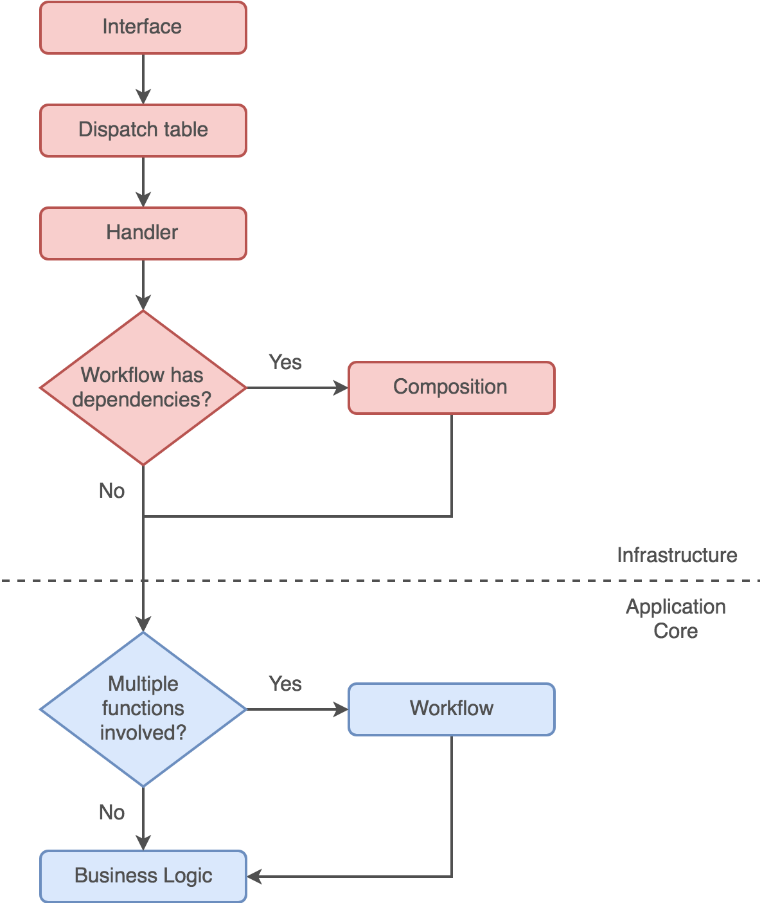

# Architecture

The implementation of Chainium blockchain software follows the architecture approach originally named [Ports and Adapters](http://alistair.cockburn.us/Hexagonal+architecture). This approach has later had many reincarnations (e.g. [Onion Architecture](http://jeffreypalermo.com/blog/the-onion-architecture-part-1), [Clean Architecture](https://8thlight.com/blog/uncle-bob/2012/08/13/the-clean-architecture.html)), which vary in details, but are all based on the same concepts and rely heavily on the [Dependency Inversion Principle](https://en.wikipedia.org/wiki/Dependency_inversion_principle). This architecture approach is very well established in software industry, and can be applied to object oriented (OO), as well as functional programming (FP) paradigm, albeit concrete implementation techniques are different.

More info about applying Ports and Adapters architecture in F# can be found in [this article by Mark Seemann](http://blog.ploeh.dk/2016/03/18/functional-architecture-is-ports-and-adapters).

## Dependency Injection

A common way to apply Dependency Inversion Principle to the codebase is using a technique called [Dependency Injection](https://en.wikipedia.org/wiki/Dependency_injection) (DI). In OO languages this is usually achieved using constructor injection or property/setter injection. In FP languages, dependencies can be injected using [partial application](https://en.wikipedia.org/wiki/Partial_application) ([here's the F# specific explanation](https://fsharpforfunandprofit.com/posts/partial-application)).

Although there are alternatives to DI in FP (e.g. [free monad](http://blog.ploeh.dk/2017/08/07/f-free-monad-recipe)), we find partial application to be a simple and pragmatic technique, approachable to the developers of different skill levels.

## Composition

Composition is the stage in the life cycle of an application, in which dependencies are being resolved and injected.
While in OO languages composition of the application is usually handled by the [IoC Container](https://www.martinfowler.com/articles/injection.html), in FP languages this can be handled by composing new functions from other partially applied functions.

For this purpose we have a `Composition` module in the infrastructure layer, which performs two main tasks:
1. Partially apply concrete implementation functions from infrastructure layer, by passing in the infrastructure details (e.g. database connection string, file system path, etc.), to create new functions which can satisfy the dependency signature of the functions in the application core.
2. Partially apply functions from the application core, by passing in the composed functions from the step 1, to create new functions which can act upon data inputs.

More info about this technique can be found in following articles by Mark Seemann:
- [Partial application is dependency injection](http://blog.ploeh.dk/2017/01/30/partial-application-is-dependency-injection)
- [Dependency rejection](http://blog.ploeh.dk/2017/02/02/dependency-rejection)

**IMPORTANT:**
The sole purpose of the functions defined in the `Composition` module is to compose the application by injecting dependencies. It is therefore very important to avoid having any business logic in these functions. They should be as thin as possible.

## Workflows

Top level processes in the codebase are defined in `Workflows` module in the application core. Functions in this module contain high level workflows, which orchestrate execution of smaller parts of the business logic contained in the application core. Workflows are often composed of multiple functions combined into one big pipeline.

Execution of business logic in the functions can result in errors, which is communicated to the caller by returning the `Result` type (part of the F# standard library). To be able to combine functions which return the value of `Result` type, we use [bind](https://fsharpforfunandprofit.com/series/map-and-bind-and-apply-oh-my.html) operator `>>=`, which is just a syntactic sugar for `Result.bind` function.

More information about this approach can be found in [the work of Scott Wlaschin](https://fsharpforfunandprofit.com/rop).

## High Level Flow

This diagram explains how to construct the handling of a command from its entrance into the system, until the business logic.

1. A command enters the system from outside world through the interface. Interface can represent an API request, a command entered on OS terminal, a network request from the peer, etc.
2. Once command enters the system, it first goes to Dispatch table, where it is mapped to the corresponding handler in the code. The Dispatch table can be a list of API routes, a list of terminal commands, or a list of network commands - it depends on the use case.
3. Command handler takes command parameters (e.g. DTO constructed from JSON payload, or command line arguments) and passes them to the corresponding workflow, unless the workflow has dependencies.
4. If workflow has dependencies, we first have to compose it in the Composition module and make the handler call the composed function, which in turn calls the workflow function.
5. Workflow function then takes the input and executes the required business logic.

The code in the infrastructure layer of the application (upper part of the diagram) should be kept as thin and as "dumb" as possible. All business rules should be contained within the application core, which makes the codebase highly testable.

## Project Structure

Project | Description | Layer
--- | --- | ---
`Chainium.Common` | Common generally reusable code | Cross-cutting
`Chainium.Blockchain.Common` | Common project-specific code | Cross-cutting
`Chainium.Blockchain.Public.Core` | Types, code contracts, logic, consensus | Core
`Chainium.Blockchain.Public.Crypto` | Cryptography | Core
`Chainium.Blockchain.Public.Data` | Data persistance | Infrastructure
`Chainium.Blockchain.Public.Net` | Network communication between nodes | Infrastructure
`Chainium.Blockchain.Public.Node` | Application host / composition root / API | Infrastructure
`Chainium.Blockchain.Public.Wallet` | Application host / composition root / CLI | Infrastructure
