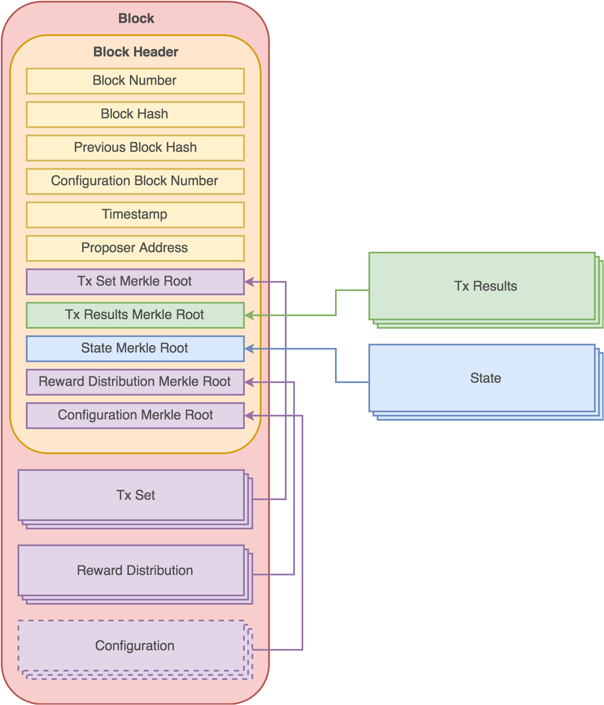

# Blockchain Data Structures

## Block

A block in Own public blockchain has following structure:

Element | Description
---|---
Block Number | 64-bit integer
Block Hash | SHA256 hash of other fields combined together.
Previous Block Hash | SHA256 hash of the previous block in the chain.
Configuration Block Number | Number of the configuration block this block is validated against.
Timestamp | 64-bit integer containing Unix timestamp in milliseconds.
Proposer Address | Blockchain address of the block proposer.
Tx Set Merkle Root | Merkle tree root of all Tx hashes from Tx Set
Tx Results Merkle Root | Merkle tree root of all Tx hashes and corresponding processing results.
State Merkle Root | Merkle tree root of all state entries related to Tx Set belonging to the block.
Reward Distribution Merkle Root | Merkle tree root of reward distribution entries.
Configuration Merkle Root | Merkle tree root of the configuration (applies to configuration blocks only).
