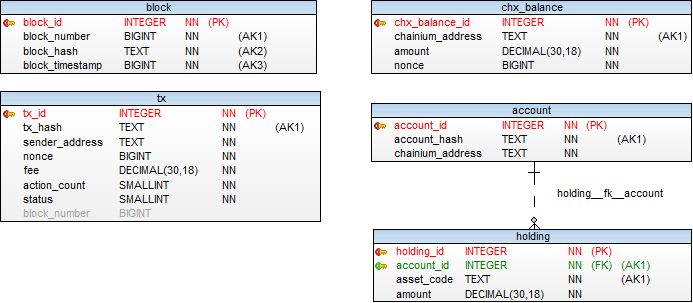

# Public Node - Physical Database Model

The purpose of this document is to describe physical database model of a node in a chainium public blockchain.
In order to validate transactions, a node needs to be able to store the data. A node stores data in a raw file storage and a relational database. The nodes on our blockchain can select following database engines to store relational data:
* SQLite for a lightweight node
* PostgreSQL for a full-scale node

This document will present the physical database model and describe all the tables with their columns and constraints. There is no difference between database models in a lightweight (SQLite) and a full-scale (PostgreSQL) node.

## Physical Model

The physical database model below shows the tables and relationships between them. In a nutshell, the relational database keeps information about transactions, CHX balances and equity holding. The tables and their relationships are shown in the picture below.

## Tables

Following tables will be described in this chapter:
* `chx_balance`
* `account`
* `holding`
* `block`
* `tx`

### `chx_balance` table

`chx_balance` table stores CHX balance for a Chainium address. Each direct user of the system needs to have at least one Chainium address, with CHX tokens on it, in order to submit the transaction. However, the act of creating a Chainium address (e.g. using the wallet software) will not create the entry in this table. An entry will be stored here once the address receives CHX Tokens for the first time.

Chainium address is used to "control" the investor account which holds the equity. This basically means that an investment account can hold an equity only through the existing Chainium address. One Chainium address can control multiple investor accounts.

| Name | Data Type | Nullable | Key | Description |
|------|-----------|----------|-----|-------------|
| `chx_balance_id` | INTEGER | NOT NULL | PK | A unique ID and surrogate primary key.
| `chainium_address` | TEXT | NOT NULL | AK | Chainium address which controls the account. It is unique per record and represents an alternate key.
| `amount` | DECIMAL (30,18) | NOT NULL | | Amount in CHX tokens held by the `chainium_address`.
| `nonce` | BIGINT | NOT NULL | | Nonce represents number of processed transactions sent from `chainium_address`. It makes sure that the record is consistently updated and prevents double-spending.

### `account` table

`account` table represents a "link" to a detailed investor account entry on the private blockchain. The `account` table stores the Chainium address which "controls" this investor account.

| Name | Data Type | Nullable | Key | Description |
|------|-----------|----------|-----|-------------|
| `account_id` | INTEGER | NOT NULL | PK | A unique account ID and surrogate primary key.
| `account_hash` | TEXT | NOT NULL | AK | Alternate key, representing the hash value of the account created in the private blockchain.
| `controller_address` | TEXT | NOT NULL | | Chainium address which controls the account.

### `holding` table

`holding` table stores balance of a particular asset (tokenized equity of a business). It stores the number of "shares" of a particular asset for the investor account.

| Name | Data Type | Nullable | Key | Description |
|------|-----------|----------|-----|-------------|
| `holding_id` | INTEGER | NOT NULL | PK | A surrogate primary key of the holding.
| `account_id` | INTEGER | NOT NULL | AK | Foreign key to investor account ID.
| `asset_hash` | TEXT | NOT NULL | AK | Business asset identifier.
| `amount` | DECIMAL (30,18) | NOT NULL | | Balance of tokenized equities for the account.

A combination of an `account_id` and an `asset_hash` is unique and represents an alternate key. `account_id` in the `holding` table is a foreign key and it is linked through the `holding__fk__account` constraint to the `account` table.

### `block` table

`block` table stores the information about the last block in the chain. It is used to maintain consistency and atomicity of the changes, caused by transactions in the block, while applying them to the blockchain state.

| Name | Data Type | Nullable | Key | Description |
|------|-----------|----------|-----|-------------|
| `block_id` | INTEGER | NOT NULL | PK | A surrogate primary key.
| `block_number` | BIGINT | NOT NULL | AK | Unique number of the last created and applied block.
| `block_hash` | TEXT | NOT NULL | AK | Unique hash value of the block.
| `block_timestamp` | BIGINT | NOT NULL | AK | Unique timestamp of the block.

### `tx` table

`tx` table stores all transactions submitted to the node, or received from the network peers. This table represents the transaction pool from which pending transactions are selected for inclusion into the block, based on the rules described in [Transaction Processing](TxProcessing.md) document.

| Name | Data Type | Nullable | Key | Description |
|------|-----------|----------|-----|-------------|
| `tx_id` | INTEGER | NOT NULL | PK | A surrogate primary key.
| `tx_hash` | TEXT | NOT NULL | AK | Unique hash value of the transaction.
| `sender_address` | TEXT | NOT NULL | | Chainium address of the transaction sender.
| `nonce` | BIGINT | NOT NULL | | Nonce prevents double-spending because Noncetx must be equal to (Noncesender_address + 1) for the transaction to succeed.
| `fee` | DECIMAL (30,18) | NOT NULL | | Fee is the price offered for processing of each action included in the transaction. It is expressed in CHX and serves as a primary transaction priority criteria, as well as the incentive for the nodes to validate transactions.
| `action_count` | SMALLINT | NOT NULL | | Number of actions included in the transaction.
| `status` | SMALLINT | NOT NULL | | Transaction status.
| `block_number` | BIGINT | NULL | | The number of the block in which the transaction was processed.
