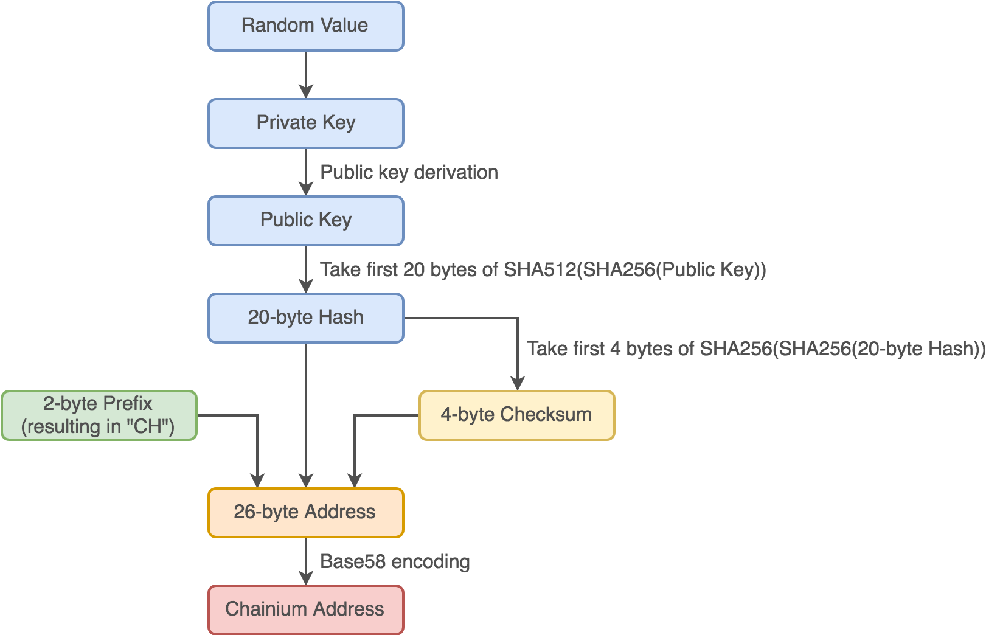

# Cryptography

## Private/Public Keys

Private/public key pairs are generated using Elliptic Curve Cryptography. Similar to other major blockchain projects, Chainium blockchain uses a specific Koblitz curve [secp256k1](https://en.bitcoin.it/wiki/Secp256k1).

Concrete implementation of algorithm used in Chainium blockchain, comes from [Bouncy Castle project](https://www.bouncycastle.org/csharp).

## Hashing

Chainium blockchain uses [SHA256](https://en.wikipedia.org/wiki/SHA-256) as the main hashing algorithm. Implementation of SHA256 is part of .NET standard library.

## Encoding

All cryptographic artifacts (private/public keys, hashes, etc...) are encoded as [Base58](https://en.wikipedia.org/wiki/Base58) strings and used as such throughout the application and external interfaces. Base58 dictionary used is the same as the one used in Bitcoin implementation.

Chainium blockchain uses the implementation of Base58 encoding from [Multiformats project](https://multiformats.io).

## Chainium Address

Chainium address is created using following algorithm:

