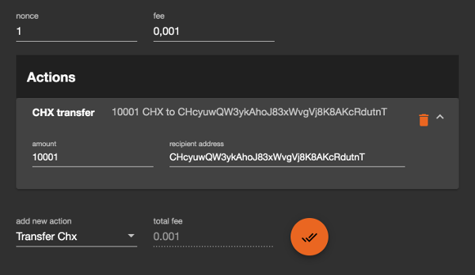
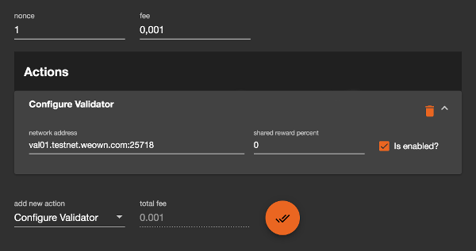
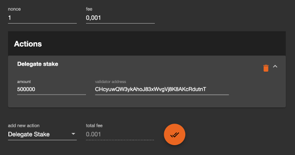

# Validator Configuration

This document describes the configuration of the validator node.


## Prerequisites

Before configuring a validator node, make sure to:

- have the node installed and accessible from public network (`PublicAddress` configured). Please refer to the [node setup document](NodeSetup.md) for more information.
- have a dedicated CHX address ready (you can generate new private key and address using [online wallet](https://wallet.weown.com/wallet)). Keep private key secure and do not share it with anyone!


## Configuring node software

For the node to be able to act as a validator, it must have `ValidatorPrivateKey` configured in the `Config.json` file. Please refer to [node environment configuration document](NodeEnvironment.md#configuration-file) for more info.

- Stop the node.
- Open configuration file in text editor (e.g. `nano` or `vim`).
    ```bash
    sudo nano /var/lib/own/blockchain/public/node/ins1/Config.json
    ```
- Add the entry with the private key you generated as described in the _Prerequisites_ section above.
    ```json
    "ValidatorPrivateKey": "XXXXXXXXXX"
    ```
- Save the file.
- Start the node.

**WARNING:** If your node is not accessible from public network, it won't be able to participate in the validation process and won't receive any rewards!

At this point your node is configured and ready to start participating in the consensus as soon as it gets included in the list of active validators (not before next config block).


## Configuring validator parameters and funding the validator address

For the node to be able to participate in the consensus and propose blocks, it needs to have:

- 10000 CHX in available balance on validator address (this is for validator deposit).

    To fund the validator address, send it 10000 CHX, plus a bit more (e.g. 1 CHX) so it can submit the transactions itself.

    

- Operational parameters configured in the blockchain.

    To configure this, send a transaction **from validator address** with `ConfigureValidator` action, specifying:

    - validator's network address (same as `PublicAddress` configured in its configuration file)
    - percent of the reward shared with stakers
    - flag saying that the node is enabled - willing to participate in consensus

    Example transaction created using [online wallet](https://wallet.weown.com/wallet):

    

- At least 500000 CHX at stake (delegated by itself or by others).

    This can be achieved by sending a transaction with `DelegateStake` action, specifying:

    - validator address (CHX address of your validator)
    - CHX amount delegated

    Example transaction created using [online wallet](https://wallet.weown.com/wallet):

    

    In this example whole stake is delegated by one staker. This might not always be the case, of course, and it might take more time until the validator gets enough stakes delegated by other addresses.


## Waiting for inclusion in the list of active validators

If all above listed steps are executed and required conditions have been met, validator is eligible to be included in the list of active validators at next config block. However, if there are more than 100 validators with 500000 CHX at stake, your validator might not make it into the top 100.

Once validator is included in the active list, it will start participating in consensus and proposing blocks.
